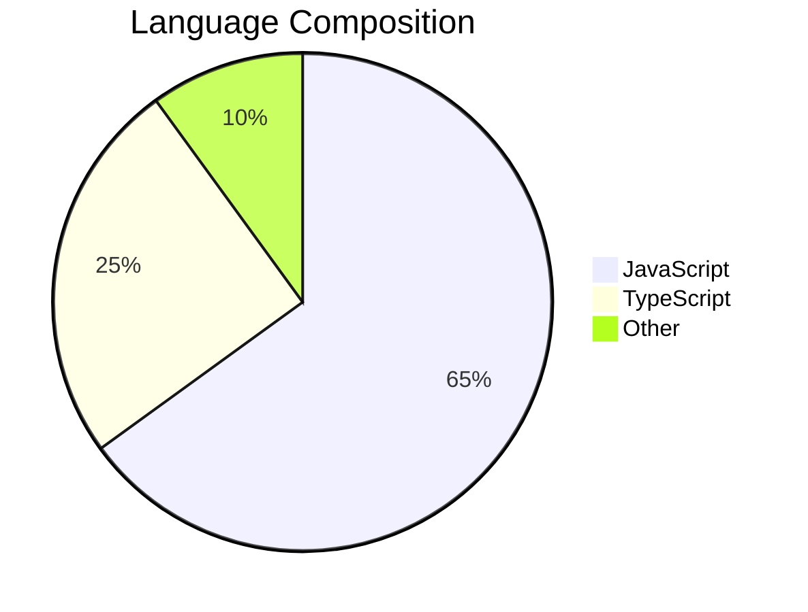

# 📜 README Generator CLI v2.0 🚀

[](https://nodejs.org/)
[](https://www.npmjs.com/package/readme-generator-cli)
[](https://github.com/xmrenigmax/ReadMeGenerator/blob/main/LICENSE)
[](https://npm-stat.com/charts.html?package=readme-generator-cli)
[](https://github.com/xmrenigmax/ReadMeGenerator/actions)
[](https://app.codecov.io/gh/xmrenigmax/ReadMeGenerator)

A powerful command-line tool to generate professional `README.md` files with smart defaults and customization options.

## 🌟 Features

### 📊 Project Intelligence
- Automatic title detection with directory name analysis
- Multi-language detection with percentage breakdown
- Dependency analysis for npm, pip, and gem projects
- Git repository integration (remote origin detection)
- License detection from common license files

### 🎨 Rich Formatting
- Dynamic badges (version, downloads, license, CI status)
- Automatic table of contents with anchor links
- Code block support with syntax highlighting
- Emoji support for visual appeal
- Responsive layout optimized for GitHub

### ⚙️ Configuration Options
- Interactive mode with guided prompts
- Config file support (.readmerc.json)
- Template overrides for custom sections
- Theming options (light/dark badge styles)

## 🛠️ Tech Stack



## Core Dependencies

### Dependencies

| Package       | Purpose                            |
|---------------|------------------------------------|
| `chalk`       | For clean, colored terminal output |
| `language-detect` | Detects project languages        |

> _Note: `inquirer` and `simple-git` are planned for future versions to add interactive setup and Git detection._

## 📦 Installation
```bash
git clone https://github.com/xmrenigmax/readme-generator-cli.git
cd readme-gen
npm install
```

## Version 1
```
Prints Title
Generated description (not customised yet)
Features title
installation title
usage title
```